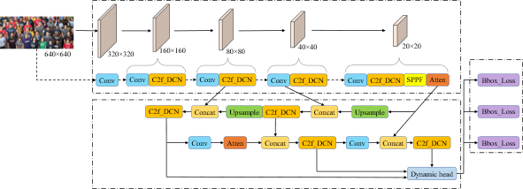

# dy-yolov8

## 一种改进YOLOv8的密集行人检测算法，发表在《图学学报》

摘要：针对密集场景中小尺度的遮挡行人容易漏检的问题，提出一种改进YOLOv8检测算法。首先，针对小尺度行人特征提取问题，采用由可变形卷积改进的骨干网络增强网络对特征的提取能力，并设计遮挡感知注意力机制增强遮挡行人可见部分特征；其次，针对密集行人场景检测头定位不准的问题，设计动态解耦头增强对多尺度行人特征的关注，提高检测头的表达能力；最后，针对模型训练效率低的问题，训练时采用Wise-IoU与分布式聚焦损失结合的回归损失，提高模型的收敛能力。通过实验结果分析，改进YOLOv8算法在2个具有挑战性的密集行人数据集CrowdHuman和WiderPerson上性能优秀，AP50分别达到90.6%和92.3%，AP50:95分别达到62.5%和68.2%。相较原算法有了较大提升，且与其他先进行人检测模型进行比较时表现出了很强的竞争力。所提算法在密集行人检测任务中具有广泛的应用前景。

